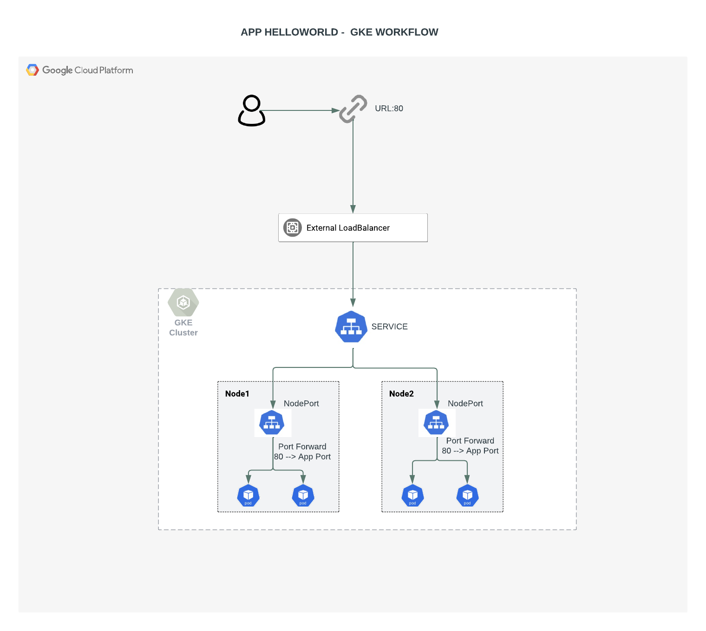
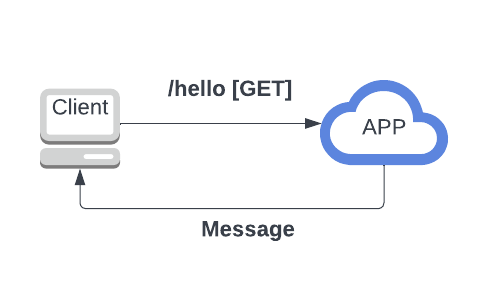

Para iniciar a aplicação para testes locais, sem container (Start App without container on local machine)

```
cd app
gunicorn --log-level debug --keep-alive 60 -b 0.0.0.0:8000 app:app 
```

>>URLs:

App               = http://34.172.25.129/hello

Prometheus  = http://34.172.250.4:9090/graph

Grafana        =  http://34.134.25.71/login


Foram criados 3 workflows para atender 3 necessidades
 1) Infraestrura GCP via terraform
 2) Deploy da App
 3) Deploys do Prometheus e Grafana
 
 Os 3 estão configurados para event_dispatcher, ou seja é possível rodar a qualquer momento.
 
 Sobre o que foi utilizado:
 
 1 - Terraform 
     - Cloud GCP
     - Criado Artifact Container Registry
     - Criado um GKE cluster com configurações managed como (horizontal autoscaler e logging)
     - Também foi utilizada a vpc e Subnet default da GCP, para simplificar o processo.
    
 2 - Github Actions 
     - Optei por criar o processo de todo o projeto através do GitHub Actions, abaixo alguns motivos:
     A) Facilidade em integrar o repositório e o próprio pipeline na mesma ferramenta
     B) Diversos providers já possuem templates pré definidos
     C) Documentação bem detalhada e disseminada
     D) Facilidade nas configurações de variaveis SECRET 
     E) OpenSource ;)
     - Foi considerado o uso do Jenkins, Azure DevOps e TravisCI. Mas todos apresentariam uma maior complexidade de configuração ou entãoo um curva maior de aprendizado o que poderia acarretar em atrasos.

 3 - Docker
     - Dockerfile simples, com as instruções para iniciar a APP com uma imagem python slim.
     A) Foi considerado subir uma  VM com as configurações necessárias, mas isso não iria garantir a integridade e compliance entre ambientes (manter os ambientes iguais ou parecidos).
     B) Também foi considerado subir uma VM com portainer e subir diretamente a imagem docker para a VM (pelo desafio optei por um Kubernetes GKE), além de ser um serviço auto gerenciado, facilitando futuras manutenções.

 4 - GKE + Kustomize
     - PARA REALIZAR DEPLOY DA APLICAÇÃO FOI CRIADO DENTRO DO PIPELINE O USO DO KUSTOMIZE
     A) KUSTOMIZE ajuda quando há vários ambientes para deploy (mesmo que nesse desafio só tenha 1 ambiente)
     B) No processo de deploy é criado um deployment e service 
     C) Utilizado um LB externo pra facilitar as configurações dentro do prazo. Também é possível configurar como LB interno e liberar acesso externo por rotas e firewall da VPC e ingress.

 5 - Monitoring
     - Foi habilitado na criação do cluster o uso das metricas padrão do GCP Monitoring, essas métricas já incluem Kubernetes e métricas de Infra de containers, incluindo a APP.
     - Foi utilizado prometheus + grafana dentro do cluster (namespace prometheus), mantive as dashboards padrão dessa stack, já que as mesmas trazem bastante informação relevante.

#############################################################################################

>>ENGLISH

  3 workflows were created to meet these requirements:
   1) GCP infrastructure through terraform
   2) App Deployment
   3) Deployments of Prometheus and Grafana
   

   All workflows are set to event_dispatcher, so it is possible to run at any time.
   
   
   About what was used:
 
    1 - Terraform
        - GCP Cloud
        - Created Artifact Container Registry
        - Created a GKE cluster with managed configurations like (horizontal autoscaler and logging)
        - GCP's default vpc and Subnet was also used, just to simplify the process.
        
    2 - Github Actions
         - All Pipeline process is through GitHub Actions, below are some reasons:
         A) Easy integration with repository and the pipeline itself.
         B) Several providers already have predefined templates
         C) Very detailed and widespread documentation
         D) Easy secret variables settings
         E) OpenSource ;)
         - I`ve considered using Jenkins, Azure DevOps and TravisCI. But all would present a higher configuration complexity or a higher learning curve which could lead to delays.
         
    3 - Docker
         - Simple dockerfile, with instructions to start the APP with a python slim image.
         A) It was considered to upload a VM with necessary configurations, but this would not guarantee the integrity and compliance between environments (keep the environments the same or similar).
         B) It was also considered to upload a VM with portainer and directly upload the docker image to the VM (for the challenge I choose a Kubernetes GKE), in addition to being a self-managed service, facilitating future maintenance.
         
    4 - GKE + Kustomize
         - For application Deploy is used KUSTOMIZE inside Deploy workflow
         A) KUSTOMIZE helps when there are several environments to deploy (even if in this challenge there is only 1 environment)
         B) In the deployment process, a kubernetes deployment and service are created
         C) It was considered an external LB (nginx) but to keep track of delivering this task on time, this responsability is done by kubernetes service exposing an public IP (external GCP Loadbalancer). It is also possible to configure as internal LB and allow external access through routes and firewall of the VPC and ingress.  
         
    5 - Monitoring
         - Standard GCP Monitoring metrics is enabled in the creation of the cluster, these metrics already include Kubernetes and Container Infra metrics, including the APP.
         - Prometheus + grafana is used within the cluster (prometheus namespace), I kept the standard dashboards of this stack, because they bring a lot of relevant information.      
         
         
         
         
         
   
  
  ### App Workflow
   
    
